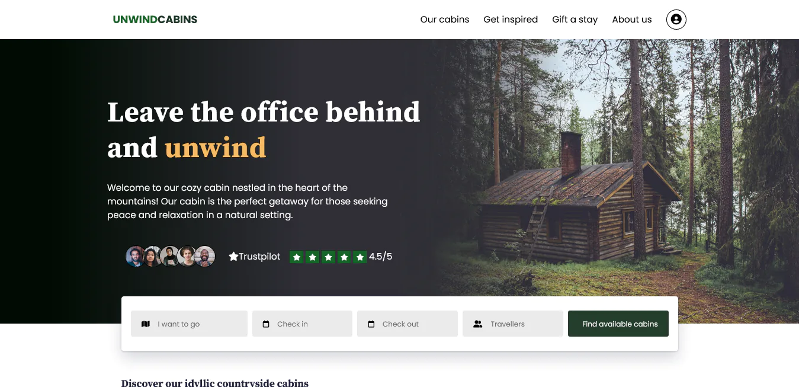
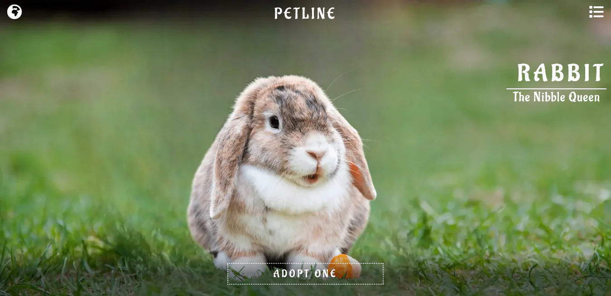
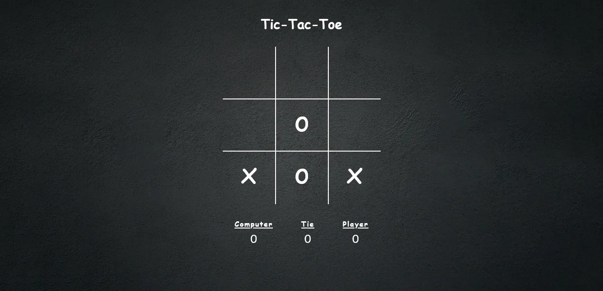
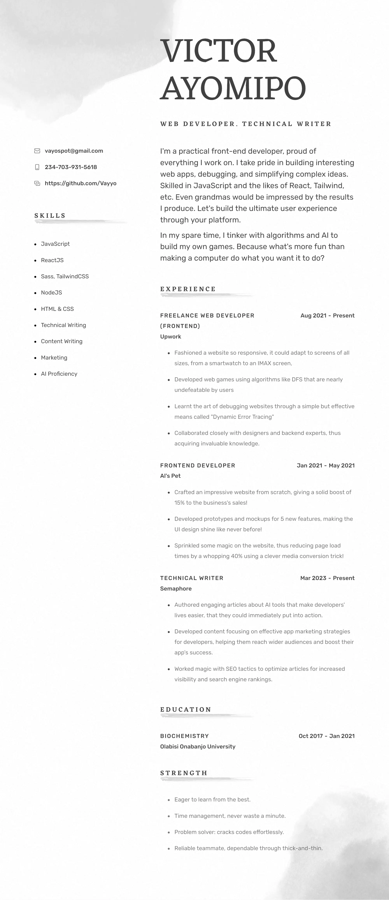

<h1 align="center">THE PORTFOLIO</h1>

Greetings! I am Victor Ayomipo :bust_in_silhouette:.

I am a Programmer, a Content writer, and a Conqueror of new technologies. 

As you browse through my portfolio, you'll see firsthand the passion and dedication I bring to every project. 

I am ready to take on any challenge for I deliver outstanding results no matter what.

Behold, my little stash of mighty creations and written articles and guides that demonstrate my skills and ingenuity! :ok_hand:

:mag_right: Go on. Have a look.

<h2 align="center">:file_folder: Projects</h1>

- ### Slacker University

  *A highly responsive university website that fit all screens*
  
  
  
  > **[Check it out](https://vayyo.github.io/Slacker-University/)**
  
---
- ### CARLONY Outlet

  *A car outlet that adopts the modern design and simplicity everyone likes*
  
  
  
  > **[Check it out](https://vayyo.github.io/Carlony/)**
  
---
- ### Tour Figma Clone

  *A Tour website that's cloned perfectly from a figma template*
  
  
  
  > **[Check it out](https://vayyo.github.io/Figma-Website-Clone/)**
  
---
- ### The Mazee
   
  *A maze game that's generated using DFS algorithm. It also has the ability to solve itself.*
  
  
  
  > **[Check it out](https://vayyo.github.io/The-Mazee/)**
  
---
- ### PETLINE Store

  *A pet store for everything pet related*
  
  
  
  > **[Check it out](https://vayyo.github.io/PETLINE/)**
  
---
- ### Tic-Tac-Toe
   
  *An unbeatable player vs computer Tic-Tac-Toe game.*
  
  
  
  > **[Check it out](https://vayyo.github.io/tic-tac-toe.github.io/)**
  
  
  &nbsp; &nbsp;

<h2 align="center">:scroll: Articles & Blogs</h2>

- **Taking Website Responsiveness To The Moon - [Read Here](https://vayo.hashnode.dev/how-to-make-websites-responsive-for-all-devices)**
- **10 Best Alternatives To ChatGPT: Developer Edition - [Read Here](https://semaphoreci.com/blog/chatgpt-alternatives)**
- **Building Mazes with Depth First Search: How-To Guide - [Read Here](https://vayo.hashnode.dev/building-mazes-with-depth-first-search-how-to-guide)**
- **Explaining "this" Keyword In JavaScript - [Read Here](https://vayo.hashnode.dev/explaining-this-keyword-in-javascript-like-youre-five)**
- **16 Jobs That Will Never Be Replaced By AI - [Read Here](https://medium.com/@vayospot/16-jobs-that-will-never-be-replaced-by-ai-5acae681bf)**
- **The Transparent Speaker: Where Sound and Beauty Meet - [Read Here](https://medium.com/@vayospot/the-transparent-speaker-where-sound-and-beauty-meet-648cbc883852)**

  
  &nbsp; &nbsp;

<h2 align="center">:scroll:Resume</h2>
  
  
  
  > **[View PDF](https://github.com/Vayyo/Vayyo/blob/main/victor_ayomipo_resume.pdf)**

&nbsp; &nbsp;

### :telescope: Let's Connect
- **Email - vayospot@gmail.com**
- **[Twitter](https://twitter.com/Vayo_tweet)**
- **[LinkedIn](https://www.linkedin.com/in/ayomipo-victor-b82875265/)**
- **[Medium](https://medium.com/@vayospot)**

